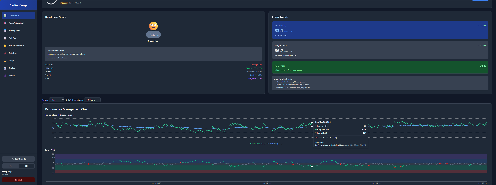
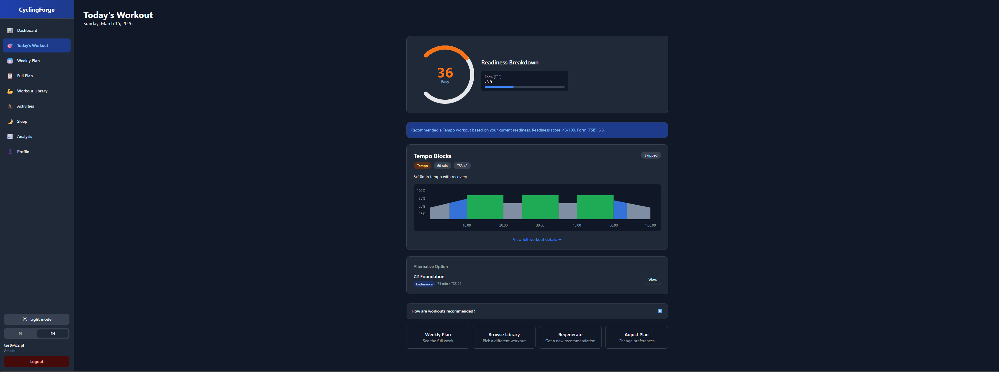
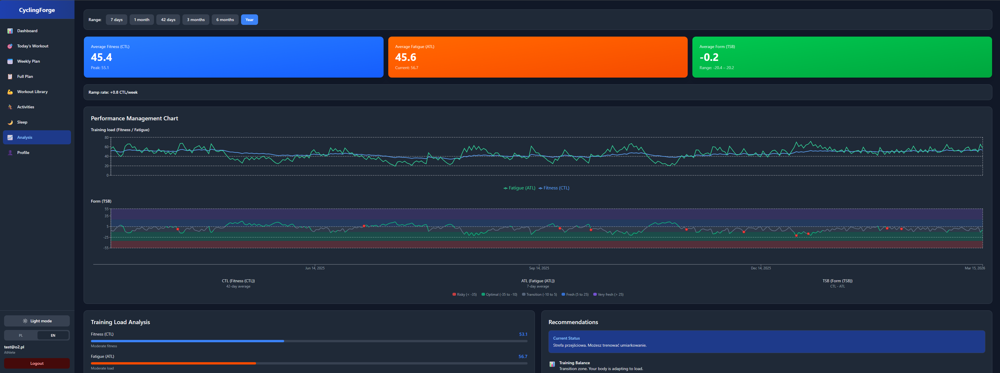
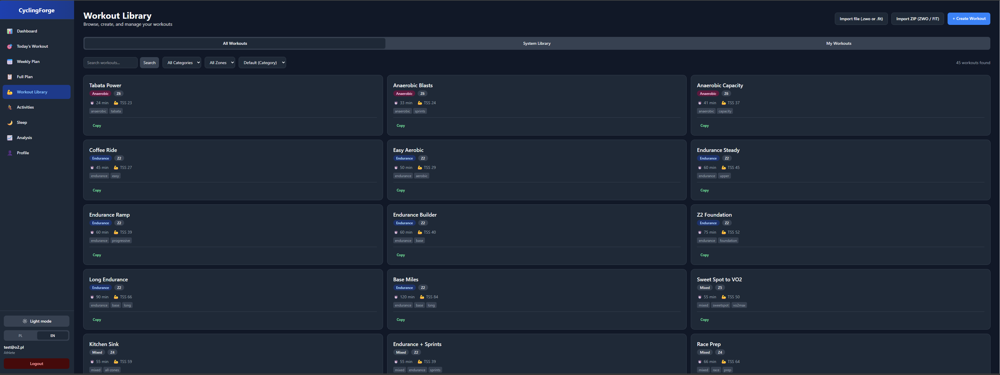
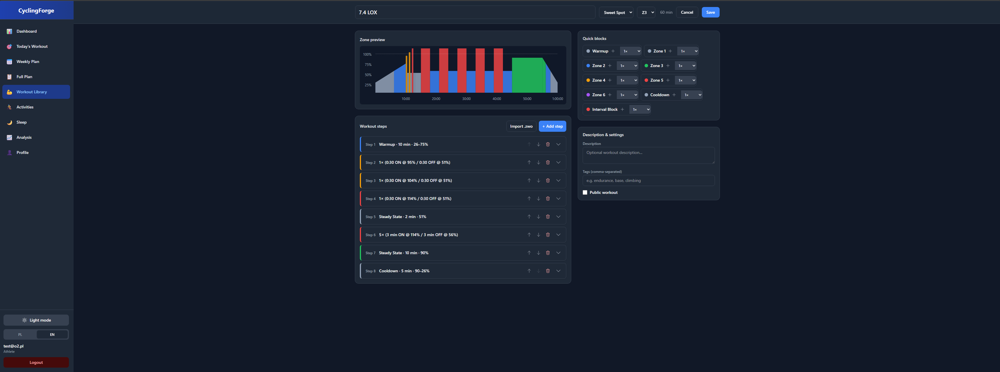
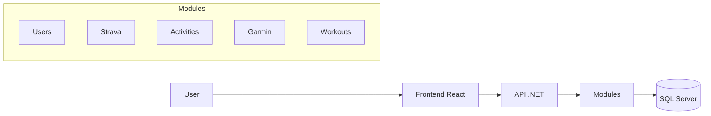

# CyclingForge

Aplikacja dla kolarzy do analizy treningu, śledzenia PMC (Performance Management Chart), otrzymywania rekomendacji treningowych oraz integracji ze Strava i Garmin.

Modularny monolit zbudowany w .NET i React: Clean Architecture, Domain-Driven Design (DDD), CQRS (MediatR). Obejmuje integracje ze Strava (aktywności) i Garmin (wellness, sen), metryki treningowe (TSS, NP, IF, HRSS, eFTP, PMC), rekomendacje dzienne i plany tygodniowe/wielotygodniowe.

---

## Podgląd aplikacji

| Dashboard | Rekomendacja na dziś |
|-----------|----------------------|
|  |  |

| Analiza PMC | Biblioteka treningów |
|-------------|----------------------|
|  |  |

| Designer treningu |
|-------------------|
|  |

---

## Architektura i stos technologiczny

### Backend

- **.NET** (ASP.NET Core Web API). Wejście: [`src/Bootstrapper/CyclingForge.Bootstrapper/Program.cs`](src/Bootstrapper/CyclingForge.Bootstrapper/Program.cs)
- **Modular monolith**: moduły **Users**, **Strava**, **Activities**, **Garmin**, **Workouts**; każdy z warstwami Api, Application, Domain, Infrastructure (tam gdzie stosowane).
- **CQRS** (MediatR), FluentValidation, **JWT** authentication, **Entity Framework Core 10** + **SQL Server** (osobny DbContext na moduł).
- **Bootstrapper**: składanie modułów, `UserFtpProvider`, `ReadinessDataProvider`, `RecommendationEngine`, CORS (frontend localhost:5173), Swagger.

### Frontend

- **React 18**, TypeScript, **Vite 7**, **Tailwind v4**, Material Tailwind, **Recharts**, react-router-dom v7, axios, **i18next** (pl/en).
- **Internacjonalizacja i motyw**: Aplikacja obsługuje języki **polski** i **angielski** (i18next, fallback `pl`, zapis w localStorage; przełącznik w [`frontend/src/components/Layout.tsx`](frontend/src/components/Layout.tsx)); namespace'y dla wszystkich stron – pliki w [`frontend/src/locales/pl/`](frontend/src/locales/pl/) i [`frontend/src/locales/en/`](frontend/src/locales/en/). Tryb **jasny/ciemny** (ThemeContext w [`frontend/src/context/ThemeContext.tsx`](frontend/src/context/ThemeContext.tsx)): zapis w localStorage, respektowanie `prefers-color-scheme`; przełącznik w nawigacji; osobne palety kolorów dla wykresów.
- Wejście: [`frontend/src/main.tsx`](frontend/src/main.tsx), routing w [`frontend/src/App.tsx`](frontend/src/App.tsx).
- Stan: AuthContext (localStorage), brak globalnego store; strony używają `useState` + API przez [`frontend/src/services/api.ts`](frontend/src/services/api.ts) (proxy `/api` + Bearer token).

### Baza danych

- SQL Server, EF Core, migracje per moduł (Users, Strava, Activities, Garmin, Workouts). Wzorce: repozytoria, `IUnitOfWork` (Shared.Abstractions).

---

## Moduły i API

| Moduł | Endpoint / obszar | Opis |
|-------|-------------------|------|
| **Users** | `api/Users` | Rejestracja, logowanie (JWT), profil użytkownika (FTP, waga, HR, płeć, LTHR). |
| **Strava** | `api/Strava` | OAuth 2.0, zarządzanie tokenami, synchronizacja aktywności. |
| **Activities** | `api/Activities`, `api/Metrics` | Lista i detale aktywności, strumienie; PMC, dzienne TSS, podsumowania tygodniowe i miesięczne. |
| **Garmin** | `api/Garmin` | Połączenie (OAuth), wellness, sen, Body Battery, Training Readiness, stres. |
| **Workouts** | `api/Workouts`, `api/Recommendations`, `api/training-preference`; `api/Workouts/{id}/export` (ZWO), `api/Workouts/{id}/export/fit` (FIT), `api/Workouts/import-zip` | Biblioteka treningów (CRUD). **Import**: pojedynczy plik ZWO (XML) lub FIT; archiwum ZIP z plikami .zwo/.fit (zbiorczy import). **Eksport**: trening do pliku .zwo (XML) lub .fit. Rekomendacje dzienne/tydzień/plan, preferencje treningowe. |

- **Users**: kontroler [`CyclingForge.Modules.Users.Api/Controllers/UsersController.cs`](src/Modules/Users/CyclingForge.Modules.Users.Api/Controllers/UsersController.cs).
- **Strava**: [`CyclingForge.Modules.Strava.Api/Controllers/StravaController.cs`](src/Modules/Strava/CyclingForge.Modules.Strava.Api/Controllers/StravaController.cs).
- **Activities**: [`ActivitiesController.cs`](src/Modules/Activities/CyclingForge.Modules.Activities.Api/Controllers/ActivitiesController.cs), [`MetricsController.cs`](src/Modules/Activities/CyclingForge.Modules.Activities.Api/Controllers/MetricsController.cs).
- **Garmin**: [`CyclingForge.Modules.Garmin.Api/Controllers/GarminController.cs`](src/Modules/Garmin/CyclingForge.Modules.Garmin.Api/Controllers/GarminController.cs).
- **Workouts**: [`WorkoutsController.cs`](src/Modules/Workouts/CyclingForge.Modules.Workouts.Api/Controllers/WorkoutsController.cs), [`RecommendationsController.cs`](src/Modules/Workouts/CyclingForge.Modules.Workouts.Api/Controllers/RecommendationsController.cs), [`TrainingPreferenceController.cs`](src/Modules/Workouts/CyclingForge.Modules.Workouts.Api/Controllers/TrainingPreferenceController.cs).

---

## Przepływ danych i główne funkcje

- **Rejestracja / logowanie** → JWT → requesty z nagłówkiem `Authorization: Bearer`.
- **Profil**: ustawienie FTP (ręczne + zmiany w czasie), waga, HR (max, spoczynkowe, LTHR), płeć – używane w kalkulacjach (TSS, HRSS, strefy, eFTP).
- **Strava**: OAuth → synchronizacja aktywności → zapis w module Activities; dla aktywności z mocą: NP/IF/TSS (FTP z daty); bez mocy: HRSS × sport factor przy syncu ([`SyncActivitiesCommandHandler`](src/Modules/Activities/CyclingForge.Modules.Activities.Application/Commands/SyncActivities/SyncActivitiesCommandHandler.cs)).
- **Garmin**: OAuth → wellness/sen → dane używane w **readiness** (Body Battery, Sleep Score, Training Readiness, stres).
- **PMC**: dzienne obciążenie (TSS lub HRSS z czynnikiem sportu) → EWMA CTL/ATL/TSB → wykres i podsumowania (Metrics API).
- **Rekomendacje**: readiness (ważona mieszanka TSB, Garmin, PMC) → typ dnia (odpoczynek / alternatywa / trening) i kategoria treningu → wybór workoutu z biblioteki (scoring, unikanie powtórzeń, preferencje) → zapis `DailyRecommendation`.



---

## Algorytmy i współczynniki

### 5.1 Metryki mocy (Coggan / Science to Sport)

**Plik:** [`TrainingMetricsCalculator.cs`](src/Modules/Activities/CyclingForge.Modules.Activities.Application/Services/TrainingMetricsCalculator.cs)

- **Normalized Power (NP)**: średnia krocząca 30 s → każda wartość do potęgi 4 → średnia → pierwiastek 4. stopnia.
- **Intensity Factor (IF)**: $\text{IF} = \text{NP} / \text{FTP}$
- **TSS**: $\text{TSS} = \frac{\text{duration}\_{\text{seconds}} \times \text{NP} \times \text{IF}}{\text{FTP} \times 3600} \times 100$ (równoważnie $(\text{NP}/\text{FTP})^2 \times \text{duration}\_{\text{hours}} \times 100$)

### 5.2 Metryki oparte na HR

**Plik:** ten sam – `TrainingMetricsCalculator.cs`

- **hrTSS** (uproszczony, oparty na LTHR): $\text{hrTSS} = \text{duration}\_{\text{min}} \times (\text{avgHR}/\text{LTHR})^2 \times 100/60$
- **HRSS** (TRIMP znormalizowany do 1 h przy LTHR):
  - $\text{HRR} = (\text{AvgHR} - \text{RestingHR}) / (\text{MaxHR} - \text{RestingHR})$
  - $\text{TRIMP} = \text{duration}\_{\text{min}} \times \text{HRR} \times 0{,}64 \times e^{y \times \text{HRR}}$, $y = 1{,}92$ (M) / $1{,}67$ (K)
  - TRIMP przy LTHR dla 1 h; $\text{HRSS} = (\text{TRIMP} / \text{TRIMP}\_{\text{LTHR,1h}}) \times 100$
  - Dla streamu HR: wygładzanie 30 s, potem średnia i powyższe wzory.

### 5.3 Obciążenie z uwzględnieniem sportu

**Pliki:** [`ActivityLoadCalculator.cs`](src/Modules/Activities/CyclingForge.Modules.Activities.Application/Services/ActivityLoadCalculator.cs), [`ActivityLoadConfiguration.cs`](src/Modules/Activities/CyclingForge.Modules.Activities.Application/Services/ActivityLoadConfiguration.cs), sync w [`SyncActivitiesCommandHandler`](src/Modules/Activities/CyclingForge.Modules.Activities.Application/Commands/SyncActivities/SyncActivitiesCommandHandler.cs).

- Aktywności **z mocą**: TSS z NP/IF/FTP (bez sport factor).
- Aktywności **bez mocy**: HRSS × **sport factor** (zapis przy syncu). Czynniki m.in.: Walk 0,33, Hike 0,30, Ride/VirtualRide 0,72, Run 0,90, Swim 0,75, AlpineSki 0,50, BackcountrySki 0,85, NordicSki 0,90, Workout 0,70, Yoga 0,25 (pełna lista w `ActivityLoadConfiguration`).

### 5.4 eFTP (szacowanie FTP z mocy)

**Plik:** [`EftpEstimator.cs`](src/Modules/Activities/CyclingForge.Modules.Activities.Application/Services/EftpEstimator.cs)

- Wejście: najlepsze 5 / 20 / 60 min mocy (z profilu mocy); tylko przedziały ≥ `minDurationSeconds` (np. 300).
- Czynniki korekcyjne (odwzorowanie na ~1 h): 60 min → 0,98; 30 min → 0,97; 20 min → 0,95; 10 min → 0,90; 5 min → 0,75; 3 min → 0,72.
- eFTP = maksimum po korekcie z dopuszczalnych przedziałów.

### 5.5 Oś czasu FTP (UserFtpProvider)

**Pliki:** [`UserFtpProvider.cs`](src/Bootstrapper/CyclingForge.Bootstrapper/Composition/UserFtpProvider.cs), [`FtpEstimationOptions.cs`](src/Bootstrapper/CyclingForge.Bootstrapper/Composition/FtpEstimationOptions.cs)

- eFTP z 20 min: Best20Min × 0,95; reguły łączenia z ręcznym FTP i opcjami (min. wzrost waty/%, zezwalanie na spadki, min. spadek).

### 5.6 PMC (CTL, ATL, TSB)

**Plik:** [`PerformanceManagementService.cs`](src/Modules/Activities/CyclingForge.Modules.Activities.Application/Services/PerformanceManagementService.cs)

- Dzienne obciążenie: TSS (lub HRSS z czynnikiem sportu) z `ActivityLoadCalculator`, FTP z daty z `UserFtpProvider`.
- **EWMA** (Science to Sport / intervals.icu):

  $$\text{ctlFactor} = 1 - e^{-1/42}, \qquad \text{atlFactor} = 1 - e^{-1/7}$$

  $$\text{CTL} = \text{CTL}\_{\text{prev}} + (\text{TSS}\_{\text{today}} - \text{CTL}\_{\text{prev}}) \times \text{ctlFactor}$$

  $$\text{ATL} = \text{ATL}\_{\text{prev}} + (\text{TSS}\_{\text{today}} - \text{ATL}\_{\text{prev}}) \times \text{atlFactor}$$

  $$\text{TSB} = \text{CTL} - \text{ATL}$$

- Warm-up: lookback do ~120 dni dla poprawnego rozgrzania CTL.
- Strefy formy (wg TSB): Ryzykowna (&lt; -35), Optymalna (-35 do -10), Przejściowa (-10 do 5), Świeża (5 do 25), Bardzo świeża (≥ 25).

### 5.7 Readiness (gotowość do treningu)

**Plik:** [`RecommendationEngine.cs`](src/Bootstrapper/CyclingForge.Bootstrapper/Composition/RecommendationEngine.cs) – metoda `ComputeReadinessBreakdown`.

- TSB → score 0–100: mapowanie TSB z przedziału [-40, 30] liniowo na [0, 100].
- Gdy **PMC + Garmin**: wagi np. TSB 30%, Body Battery 20%, Sleep Score 20%, Training Readiness 15%, (100 − stres) 15%.
- Gdy **tylko PMC**: TSB 70%.
- Gdy **tylko Garmin**: Body Battery 35%, Sleep 30%, Training Readiness 20%, stres 15%.
- Wynik końcowy: suma składowych, clamp 0–100; brak danych → 50.

### 5.8 Rekomendacje dzienne (typ dnia i kategoria treningu)

**Plik:** ten sam – `RecommendationEngine.cs` (`DetermineRecommendationType`, `DetermineWorkoutCategory`, `ScoreWorkout`, `ApplyGoalBias`, `ApplyLevelBias`, `ApplyDaysPerWeekBias`).

- **Typ**: score &lt; 10 → Rest; score &lt; 20 + ConsiderNonCycling → Alternative; w pozostałych przypadkach → Workout.
- **Kategoria** (score → Recovery / Endurance / Tempo / SweetSpot / Threshold / VO2Max): progi score (np. &lt;15, &lt;30, …, ≥75); potem bias wg celu (FTP, wytrzymałość, sprint, race prep, weight loss), poziomu (Beginner obniża intensywność), dni/tydzień.
- **Wybór workoutu**: filtr kategoria + preferowany czas; scoring (ostatnio używane, TSS vs target, tagi, kara dla początkujących); opcjonalna alternatywa z innej kategorii.

### 5.9 Profil mocy i typ kolarza

**Plik:** [`PowerProfileAnalyzer.cs`](src/Modules/Activities/CyclingForge.Modules.Activities.Application/Services/PowerProfileAnalyzer.cs)

- Best 5 s, 1 min, 5 min, 20 min, 60 min (watty) z danych mocy.
- Benchmarks w W/kg (zakresy min–max): 5 s (11–24), 1 min (6–12,5), 5 min (4–7,5), 20 min (3–5,5), 60 min (2,5–4,5). Score znormalizowany 0–100 wg tych zakresów.
- Typ kolarza: Sprinter, Puncheur, Climber, Time Trialist, All-Rounder – z reguł na score’ach (Sprint, Anaerobic, VO2Max, Threshold, Endurance).

### 5.10 Szacowany TSS treningu (Workout)

**Plik:** [`Workout.cs`](src/Modules/Workouts/CyclingForge.Modules.Workouts.Domain/Entities/Workout.cs) – `RecalculateMetrics` / `EstimatedTSS`.

- Dla każdego kroku: $\text{tssAccumulator} \mathrel{+}= \text{duration}\_{\text{sec}} \times \text{avgPower}^2$
- $\text{EstimatedTSS} = \text{round}(\text{tssAccumulator} / 3600 \times 100)$

---

## Frontend – strony i główne flow

| Ścieżka | Plik | Przeznaczenie |
|---------|------|----------------|
| `/dashboard` | `NewDashboardPage.tsx` | Podsumowanie: PMC, dzienne TSS, podsumowania tygodnia/miesiąca, readiness, dzisiejsza rekomendacja, Garmin sleep/wellness, Strava. |
| `/workout/today` | `TodayWorkoutPage.tsx` | Rekomendacja na dziś: readiness, karta treningu, akceptacja/pominięcie/wykonanie, regeneracja. |
| `/workout/week` | `WeeklyPlanPage.tsx` | Plan tygodnia (7 dni). |
| `/workout/plan` | `FullPlanPage.tsx` | Plan wielotygodniowy. |
| `/workouts` | `WorkoutLibraryPage.tsx` | Biblioteka treningów: wyszukiwanie, filtry (kategoria, strefa), sortowanie, paginacja; **import**: pojedynczy ZWO/FIT lub archiwum ZIP (ZWO/FIT). |
| `/workouts/create`, `/workouts/:id/edit` | `WorkoutCreatorPage.tsx` | Tworzenie/edycja treningu, opcjonalny import ZWO. |
| `/workouts/:id` | `WorkoutDetailPage.tsx` | Szczegóły treningu, kopiowanie; **eksport** treningu do .zwo lub .fit. |
| `/activities` | `ActivitiesPage.tsx` | Lista aktywności (paginated). |
| `/activities/:id` | `ActivityDetailsPage.tsx` | Detale aktywności, strumienie (HR, moc, wysokość, prędkość, kadencja), wykresy. |
| `/analysis` | `AnalysisPage.tsx` | Analiza PMC (zakres 7–365 dni), statystyki (śr/max CTL, TSB). |
| `/sleep` | `SleepPage.tsx` | Dane snu z Garmin: status, synchronizacja, lista i wykresy. |
| `/training-setup` | `TrainingSetupPage.tsx` | Kreator preferencji treningowych. |
| `/profile` | `ProfilePage.tsx` | Profil użytkownika (FTP, waga, HR), połączenie Strava/Garmin. |
| `/login`, `/register` | `LoginPage.tsx`, `RegisterPage.tsx` | Logowanie i rejestracja. |
| `/strava/callback`, `/garmin/callback` | `StravaCallbackPage.tsx`, `GarminCallbackPage.tsx` | Callbacki OAuth. |

Dane pochodzą z API (metrics, recommendations, activities, garmin, workouts, users); obliczenia algorytmów wykonywane są po stronie backendu.

---

## Uruchomienie i konfiguracja

### Wymagania

- .NET 10 SDK  
- SQL Server (LocalDB lub pełna instancja)  
- Node.js (dla frontendu)

### Backend

```bash
cd src/Bootstrapper/CyclingForge.Bootstrapper
dotnet run
```

### Frontend

```bash
cd frontend
npm install
npm run dev
```

Frontend w trybie dev korzysta z proxy do API (np. Vite proxy na `/api`).

### Konfiguracja

W `src/Bootstrapper/CyclingForge.Bootstrapper/appsettings.Development.json` ustaw m.in.:

- **ConnectionStrings** – connection string do SQL Server.
- **Strava** – Client ID, Client Secret (aplikacja w Strava API).
- **Garmin** – konfiguracja OAuth (Consumer Key, Consumer Secret itd., zależnie od implementacji).

---

## Struktura repozytorium

```
src/
  Bootstrapper/          # API host, composition root (UserFtpProvider, RecommendationEngine, ReadinessDataProvider)
  Shared/                # Wspólne abstrakcje i infrastruktura (auth, moduły, persistence)
  Modules/
    Users/               # Moduł użytkowników
    Strava/              # Integracja Strava
    Activities/          # Aktywności, metryki, PMC
    Garmin/              # Integracja Garmin
    Workouts/            # Treningi, rekomendacje, preferencje
frontend/
  src/                   # React (pages, components, services, context, i18n)
tests/                   # Testy jednostkowe, aplikacyjne, integracyjne
```

---

## Licencja

Do what you want
